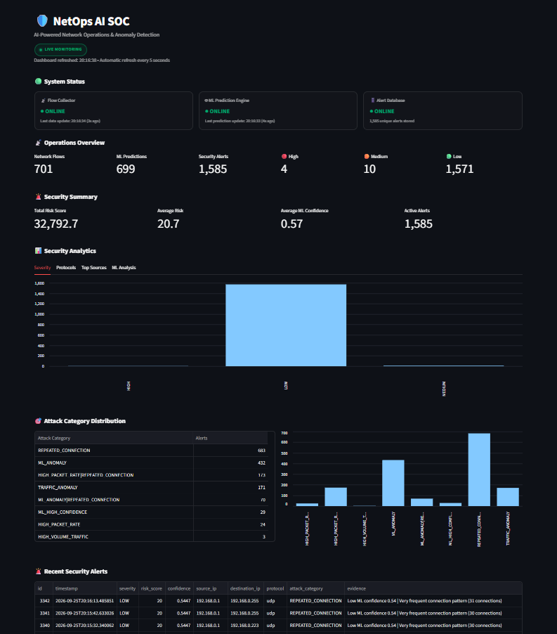
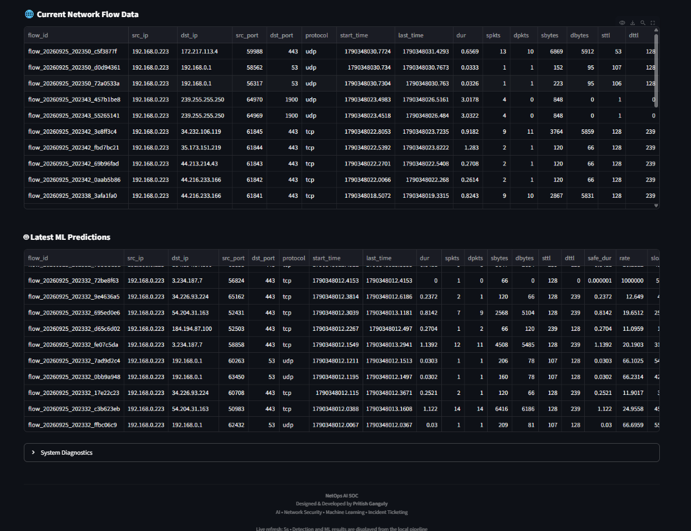
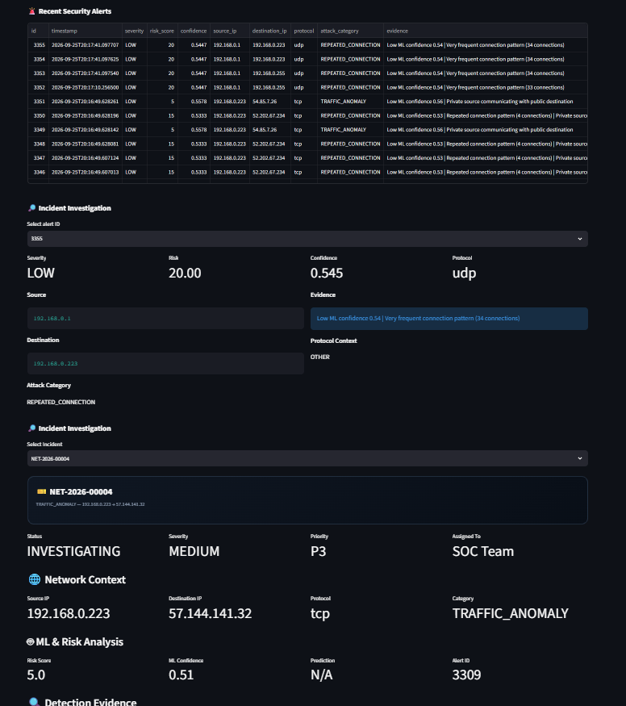
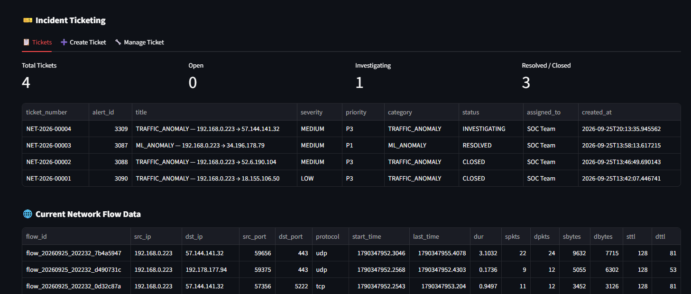

# NetOps AI SOC

**AI-powered network monitoring and security detection platform**

NetOps AI SOC is a project I built to explore how network monitoring, machine learning, security detection, and incident management can work together in one application.

The system collects live network flow information, runs machine-learning-based traffic predictions, applies additional detection rules, assigns risk to detected events, stores alerts in SQLite, and presents the results through a Streamlit-based SOC dashboard.

The project also includes an incident investigation and ticketing workflow, allowing detected events to be reviewed and converted into operational tickets.

---

## Features

- Live network flow collection
- ML-based network traffic prediction
- Random Forest hybrid classifier
- Rule-based security detection
- Risk scoring
- Alert deduplication
- SQLite-based alert storage
- Security alert classification
- Incident investigation
- Incident ticket creation and management
- New-ticket notifications
- Live dashboard updates
- Network flow visibility
- ML prediction visibility
- Security statistics and analytics
- Historical alert visibility

---

## Architecture

```text
                         Network Traffic
                                |
                                v
                     +-------------------+
                     |   Flow Collector  |
                     |       Scapy       |
                     +---------+---------+
                               |
                               v
                     Live Network Flows
                               |
                 +-------------+-------------+
                 |                           |
                 v                           v
        +------------------+        +-------------------+
        | ML Prediction    |        | Detection Engine  |
        | Engine           |        |                   |
        | Random Forest    |        | Rule-based        |
        | Hybrid Model     |        | Detection         |
        +--------+---------+        +---------+---------+
                 |                            |
                 +-------------+--------------+
                               |
                               v
                       Risk / Alert Engine
                               |
                               v
                       +---------------+
                       |   SQLite DB   |
                       | Alerts/Tickets|
                       +-------+-------+
                               |
                               v
                       +---------------+
                       | Streamlit SOC |
                       |   Dashboard   |
                       +-------+-------+
                               |
                               v
                       Incident Ticketing
```

---

## How the system works

The main workflow is:

```text
Network Traffic
      |
      v
Flow Collection
      |
      v
Live Network Flow Data
      |
      +-------------------------+
      |                         |
      v                         v
ML Prediction            Detection Engine
      |                         |
      +------------+------------+
                   |
                   v
              Risk Scoring
                   |
                   v
             Alert Storage
                   |
                   v
          SOC Dashboard
                   |
                   v
        Incident Investigation
                   |
                   v
         Incident Ticketing
```

The individual components are kept separate so that network collection, ML prediction, detection, database operations, and the dashboard can be developed and tested independently.

---

## Dashboard

The Streamlit dashboard brings the different parts of the project together in one interface.

### Dashboard overview

The main dashboard provides system status, operational information, security summaries, analytics, and attack-category information.



### Network flow and ML predictions

This view shows the current network-flow information together with the latest predictions generated by the ML pipeline.



### Security alerts and incident investigation

Detected events can be reviewed and investigated using information such as network context, detection evidence, incident description, and investigation details.



### Incident ticketing

The ticketing section allows detected incidents to be converted into tickets and tracked from the dashboard. A notification is displayed when a new ticket is created.



---

## Machine Learning

The ML component uses a **Random Forest hybrid classifier** for network traffic prediction.

The live prediction pipeline loads the trained model and processes data produced by the network-flow collection pipeline.

The trained model is kept locally because of its file size and is not included in this GitHub repository.

Expected model location:

```text
models/
└── random_forest_hybrid_classifier.joblib
```

### Development results

During development, the model produced the following results on the test data:

| Metric | Result |
|---|---:|
| Test samples | 82,332 |
| Accuracy | ~88% |
| Attack recall | ~95% |
| Attack F1-score | ~90% |

These are development/test results from this project and should not be considered production performance measurements.

---

## Detection

The project does not rely only on the ML prediction.

A separate detection engine applies additional rules to network activity and generates security events.

Some detection types observed during development include:

```text
ML_ANOMALY
TRAFFIC_ANOMALY
REPEATED_CONNECTION
```

When an event is detected, the system can assign a risk score and store the resulting alert in the SQLite database.

---

## Alert management

The alert system stores security events persistently so that they remain available after they have been generated.

An alert can contain information such as:

- Source IP
- Destination IP
- Protocol
- Risk score
- Severity
- Detection type
- Timestamp

The system also performs alert deduplication to reduce repeated entries for the same event.

---

## Incident investigation

The dashboard includes an investigation view for detected security events.

Depending on the event, the investigation information can include:

- Network context
- Detection evidence
- Incident description
- Investigation details
- Source and destination information
- Detection type
- Risk information

The purpose is to provide more information around an alert instead of only displaying a single detection message.

---

## Incident ticketing

The project includes a basic ticketing workflow for handling detected incidents.

```text
Security Alert
      |
      v
Incident Investigation
      |
      v
Create Incident Ticket
      |
      v
Ticket Management
```

When a new ticket is created, the dashboard displays a notification so the operator can immediately see that a new incident has been recorded.

---

## Technology stack

| Technology | Purpose |
|---|---|
| Python | Application and processing |
| Scapy | Network traffic collection |
| Pandas | Data processing |
| NumPy | Numerical processing |
| Scikit-learn | Machine learning |
| Random Forest | Network traffic classification |
| Joblib | Model loading |
| SQLite | Alert and ticket storage |
| Streamlit | SOC dashboard |
| Streamlit Autorefresh | Dashboard refresh |

---

## Project structure

```text
netops-ai/
│
├── dashboard.py
├── database.py
├── detection_engine.py
├── flow_collector.py
├── live_prediction_hybrid.py
│
├── models/
│   └── random_forest_hybrid_classifier.joblib
│
├── docs/
│   ├── dashboard-overview.png
│   ├── network-ml.png
│   ├── security-alerts-and-investigation.png
│   └── ticketing.png
│
├── requirements.txt
├── .gitignore
├── LICENSE
└── README.md
```

Older development and experimental scripts are kept locally in the development archive and are not part of the main GitHub source tree.

---

## Installation

### 1. Clone the repository

```powershell
git clone https://github.com/pritish-ganguly/netops-ai-soc.git
cd netops-ai-soc
```

### 2. Create a virtual environment

```powershell
python -m venv .venv
```

Activate it:

```powershell
.\.venv\Scripts\Activate.ps1
```

### 3. Install dependencies

```powershell
pip install -r requirements.txt
```

---

## Model setup

The live prediction engine expects the trained model at:

```text
models/random_forest_hybrid_classifier.joblib
```

The model is intentionally excluded from Git because of its large file size.

Place the trained model in the `models` directory before starting the ML prediction engine.

---

## Running the project

The current version runs several components separately.

Open a separate terminal for each component.

### Terminal 1 — Flow Collector

```powershell
python flow_collector.py
```

### Terminal 2 — ML Prediction Engine

```powershell
python live_prediction_hybrid.py
```

### Terminal 3 — Detection Engine

```powershell
python detection_engine.py
```

### Terminal 4 — Dashboard

```powershell
streamlit run dashboard.py
```

The dashboard should then be available at:

```text
http://localhost:8501
```

---

## Runtime flow

When all components are running, the main flow is:

```text
flow_collector.py
        |
        v
Live Network Flow Data
        |
        +----------------------+
        |                      |
        v                      v
live_prediction_hybrid.py   detection_engine.py
        |                      |
        +----------+-----------+
                   |
                   v
             Risk / Alerts
                   |
                   v
               SQLite
                   |
                   v
            Streamlit Dashboard
                   |
                   v
          Incident Ticketing
```

---

## Runtime data

The application creates local data while it is running.

Examples include:

```text
data/live_network_flows.csv
data/live_predictions.csv
data/live_alerts.csv
data/netops_alerts.db
```

These files are generated locally and are intentionally excluded from Git.

Training datasets and processed datasets are also excluded from the repository.

---

## GitHub repository

The project source code and documentation are available here:

**[GitHub Repository](https://github.com/pritish-ganguly/netops-ai-soc)**

---

## Current status

The current local version includes:

- [x] Network flow collection
- [x] ML prediction
- [x] Detection engine
- [x] Risk scoring
- [x] Alert persistence
- [x] Alert deduplication
- [x] Streamlit dashboard
- [x] Security analytics
- [x] Incident investigation
- [x] Incident ticketing
- [x] New-ticket notification
- [x] Git repository
- [x] GitHub documentation
- [x] Dashboard screenshots

The project is currently intended as a practical NetOps/SecOps portfolio and learning project rather than a production SOC platform.

---

## Future improvements

Some areas that could be added in future versions include:

- Authentication and user roles
- Threat-intelligence integration
- IP and domain reputation checks
- Email or messaging notifications
- Advanced alert correlation
- Model monitoring
- Model retraining
- Automated testing
- API layer
- Containerized deployment
- Cloud deployment
- Production database support

---

## License

This project is licensed under the MIT License.

See the [LICENSE](LICENSE) file for details.

---

## Author

**Pritish Ganguly**

M.Tech CSE | B.Tech CSE

[GitHub](https://github.com/pritish-ganguly)